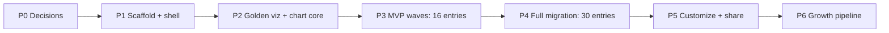

# Numbers Speak — Implementation Plan
# Цифри говорять — план реалізації

> **Status:** v0.2 · owner decisions D1–D10 accepted · 2026‑09‑17 (v0.1, the original draft, stays in `src/D3/docs/PLAN.md`)
> **Scope:** visualizations from `src/D3/Contribution` and `src/D3/d3_collections` (copied to `_examples/`, gitignored) only. Learning exercises
> (`00–05`, `Data visualization fundamentals`, `bar-chart-population`, `attempts`, `d3.html`) are **out of scope**
> (owner decision, 2026‑09‑17).
> **Bilingual:** English first (Part A), then Ukrainian (Part B). Code blocks and the inventory (Appendix C)
> are shared by both parts.
> **Convention:** proposals are ranked, each with an argument and an estimate; the owner decides, commits
> and deploys (guides standard §3.4, §3.10).

## Contents / Зміст
- **Part A — English:** A1 Summary · A2 What was studied · A3 Technology options · A4 Target architecture ·
  A5 Catalog taxonomy · A6 Visualization page · A7 Phased plan · A8 Adding new visualizations · A9 Risks ·
  A10 Decisions · A11 Data questions
- **Частина B — Українською:** B1–B11 (ті самі розділи)
- **Appendix C** — Inventory / Інвентар · **Appendix D** — Sources / Джерела · Changelog

---

# Part A — English

## A1. Summary

1. **One new repo, same family.** `numbers-speak` → `https://endorrfin.github.io/numbers-speak/`,
   in `src/guides/numbers-speak/` next to the guides, built on the guides' Tier‑1 stack (React 19.2 · Vite 8 ·
   TypeScript 6 strict · hash router · `Localized {en, uk}` · GitHub Actions deploy · `npm run verify`)
   plus **D3 7.9.0 from npm**.
2. **Port, don't embed.** 38 folders → 33 unique visualizations → **30 catalog entries** after merging
   EN/UA copies and superseded versions. Four reusable chart components cover 21 of the 30 entries.
3. **The catalog is data.** Every visualization has a typed manifest (`meta.ts`). Tabs, cards, filters,
   search, the "About the data" panel and share pages are generated from manifests, so adding a
   visualization never touches the shell.
4. **Each visualization page does four jobs:** show (responsive chart) · configure (chart controls +
   shared settings, all encoded in the URL) · inform (description, method, sources, licence, data table +
   download) · explain (how it is built).
5. **Effort:** MVP with 16 entries ≈ 23–32 h (phases 0–3). Full migration ≈ 42–56 h (phases 0–6,
   10–14 sessions of 3–4 h). After that: ≈ 2–3 h per new visualization on an existing chart component,
   ≈ 4–6 h for a new chart type, plus data preparation.

## A2. What was studied (facts)

**`src/guides`** — 11 project folders, 10 of them live GitHub Pages sites (the portfolio landing
`endorrfin.github.io` links 9). One standard, `_standard/GUIDE-AUTHORING-STANDARD.md` v1.1, with two
tiers. The Tier‑1 template `templates/tier1-spa` gives React 19 + Vite 8 + TS 6, `base: './'` + hash
routing, `Localized` strings, a lazy registry, `verify` = typecheck → lint → check:data → test → smoke →
build, and an Actions deploy. Automation lives in the `guide-factory` plugin (skills `new-guide`,
`author-module`, `verify-guide`, plus hooks).

**`src/D3`** — 23 MB, no git here; an older copy is in the public repo `Endorrfin/js-24` (`D3/`).
- 38 visualization folders: `Contribution` 23 (own data) and `d3_collections` 15 (mostly D3‑gallery
  adaptations, with own data or extensions).
- Three D3 majors (v3, v6, v7) loaded from two CDNs; runtime requests to jsdelivr (`us-atlas`) and to the
  Statistics Iceland PX‑Web API.
- Plain `<script>` pages, global variables, fixed widths (800–1280 px), no shared styles, no build, no tests.
- **5 EN/UA pairs are copies** (air strikes: 4 changed lines of 224, all of them strings); the two
  time‑of‑life pairs have already drifted apart in their data (Q4). The ranked‑bar family is copy‑based too
  (land area vs GDP by country: 16 changed lines of 433).
- **Sources:** 8 of 38 pages show a data source on the page (Chicago's is only in the tab title; the brand
  races keep the Interbrand link in HTML comments). Three pages load D3 twice (cdnjs 7.8.5 + d3js.org v7).
- **Largest dataset:** the settlements tree — 29,581 settlements / 1,763 hromadas / 139 districts /
  25 regions. `data_ua.json` is 2.6 MB (1.38 MB minified; 20–85 KB per region; a 6 KB region + district
  skeleton). `data_eng.json` is stored twice; the raw `.xlsx` is 4.9 MB.
- Tooltips build HTML from data with `.html()`. Several pages carry copy‑paste titles
  (`GPI.html` → "Crime Index…", `real-estate.html` → "Robotization").

## A3. Technology options (ranked)

| # | Option | For | Against | Verdict |
|---|---|---|---|---|
| 1 | **React 19 + Vite 8 + TS 6 + D3 7.9** (guides Tier‑1, adapted) | Same standard, template, CI gates, bilingual model and Claude plugin as the 10 live sites; lazy chunk per visualization; typed D3 (`@types/d3` 7.4.3); keeps D3 work visible in a React/TypeScript codebase | Every vanilla page must be ported; hash URLs share one link preview, so static share pages are needed | **Recommended** |
| 2 | **Astro 7** (MIT; the team joined Cloudflare on 2026‑01‑16 and promised to stay open source and platform‑agnostic) | A static page per visualization (own OG/SEO), content collections with schema validation, islands can run the current vanilla scripts almost unchanged | A second stack in the family: the standard, templates, smoke/verify scripts and `guide-factory` don't apply; `base` must match the repo path | Only if per‑page SEO and minimal porting matter more than uniformity |
| 3 | **Observable Framework 1.13.4** (published 2026‑03‑02) | Built for data apps: Markdown pages, build‑time data loaders (Python/Node), built‑in inputs; several `d3_collections` items come from Observable notebooks | Its own reactive runtime (not React); limited control over the shell (tabs, cards, filters); no built‑in EN/UA switch; outside the standard | Not recommended here |
| 4 | **Vanilla pages + generated index** (Tier‑2 style) | Hours, not days: copy folders, generate `index.html` from a manifest, show pages in iframes | Keeps 3 D3 majors, CDN calls, EN/UA copies, fixed widths, no shared settings; the cost grows with each of the 12–48 visualizations per year | Stop‑gap only |

## A4. Target architecture

```text
src/guides/numbers-speak/              ← repo numbers-speak (next to the guides)
  src/
    main.tsx · App.tsx
    catalog/  types.ts · rubrics.ts · catalog.generated.ts (gen:catalog) · preview.ts + previews.generated.json (gen:previews, v0.4) · search.ts
    viz/<id>/ meta.ts (manifest, SSOT) · index.tsx (page: controls + chart) · data.ts (load, parse, validate) · preview.ts (card preview) · strings.ts
    charts/   RankedBar · BarRace · HierarchyTree · LineSeries · ComboBarLine · Pyramid · Donut · Lollipop · MapTimeline
    ui/       TopBar (tabs, EN/UA, theme) · FilterBar · VizCard · VizPage (chart · settings · about · how it's built) · DataTable
    lib/      hashRouter.ts · urlState.ts · useElementWidth.ts · format.ts (Intl) · palette.ts · exportImage.ts
    i18n/     LangProvider.tsx · ui.ts
    theme/    tokens.css (light + dark; chart colours as CSS variables)
  public/     data/<id>/*.json · og/<id>.webp (share images, P5) · .nojekyll
  data-raw/   <id>/ original files + prep script (not deployed)
  scripts/    gen-catalog.ts · check-catalog.ts · check-data.ts · prep-*.ts · new-viz.ts · gen-share-pages.ts · gen-previews.ts · gen-og.ts · smoke.ts · run-tests.ts · test-*.ts
  .github/workflows/deploy.yml
  CLAUDE.md · PROJECT-BRIEF.md · CATALOG.md · README.md (EN/UA) · CHANGELOG.md
```

**Manifest (SSOT of the catalog):**

```ts
export type Lang = 'en' | 'uk';
export type Localized = { en: string; uk: string };
export type RubricId = 'ukraine' | 'world' | 'economy' | 'security' | 'knowledge';
export type ChartKind =
  | 'ranked-bar' | 'bar-race' | 'tree' | 'line' | 'combo'
  | 'bar' | 'grouped-bar' | 'pyramid' | 'donut' | 'lollipop' | 'map';

export type Source = { title: string; url: string; retrieved: string }; // https only, YYYY-MM-DD
export type Origin =
  | { kind: 'original' }
  | { kind: 'adapted'; title: string; url: string; license: string }; // e.g. 'ISC'

export type VizMeta = {
  id: string;                         // kebab-case = folder = URL slug
  title: Localized;
  subtitle: Localized;
  description: Localized;             // markdown
  rubrics: [RubricId, ...RubricId[]]; // first item = primary tab
  chart: ChartKind;
  geo: 'ukraine' | 'world' | 'usa' | 'iceland' | 'none';
  period?: { from: number; to: number };
  sources: Source[];                  // at least one
  origin: Origin;
  data: string[];                     // files in public/data/<id>/
  status: 'draft' | 'published';
  added: string;                      // YYYY-MM-DD; "New" badge while ≤ 30 days old
  updated: string;
};
```

**D3 inside React — React owns layout and controls, D3 owns everything inside one `<svg>`:**

```tsx
export function RankedBarChart({ rows, options }: Props) {
  const ref = useRef<SVGSVGElement>(null);
  const width = useElementWidth(ref);              // ResizeObserver
  const reducedMotion = usePrefersReducedMotion(); // standard §3.9
  useEffect(() => {
    const svg = ref.current;
    if (!svg || width === 0) return;
    // pure renderer: selection.join + transitions; returns cleanup (interrupt, remove listeners)
    return renderRankedBar(svg, rows, { ...options, width, reducedMotion });
  }, [rows, options, width, reducedMotion]);       // `options` is memoized by the caller
  return <svg ref={ref} role="img" aria-label={options.label} />;
}
```

**Routes** (hash router, no router library):
- `#/` all entries · `#/t/<rubric>` a tab; filters in the query, e.g. `#/t/world?chart=ranked-bar&q=gdp`
- `#/v/<id>` a visualization; its state in the query, e.g. `#/v/gdp-by-country?region=europe&page=2`
- `#/about` method, licences, credits
- `/v/<id>/` a generated static share page (OG title, description, image) that redirects to `#/v/<id>`.
  The `#…` fragment never reaches the server, so hash URLs cannot have their own link previews.

**Data rules:**
- Clean once, at prep time: numbers as numbers (not `"27,720.70 "`); ISO 3166‑1 alpha‑2 codes instead of
  hand‑typed names and emoji flags. Names come from `Intl.DisplayNames(lang, { type: 'region' })`; flags
  come from `flag-icons` (already used in `world-map`), because Windows does not render flag emoji.
  Regions come from a fixed enum; derived values (years → days → hours) are computed, not typed.
- One dataset per visualization with `{ en, uk }` labels — no EN/UA copies.
- Lazy loading: `fetch('./data/<id>/…')` when the page opens. Large trees are split by branch
  (settlements: 6 KB skeleton + 20–85 KB per region).
- No runtime third‑party requests: D3, `topojson-client` and `us-atlas` come from npm; the Statistics
  Iceland data becomes a static snapshot with a retrieval date.

**Quality gates** (`npm run verify`): typecheck → lint → `check:catalog` (generated index is fresh) →
`check:data` (manifest complete in EN+UA, https sources, unique ids, valid enums; dataset schema: types,
ranges such as share ≤ 100 %, unique keys) → `test` (pure transforms: parse, filter, rank, aggregate) →
`smoke` (every page renders in jsdom with fixture data, in both languages, with asserted mark counts) →
`build` (+ bundle budget).

**Deploy:** the template `deploy.yml`, but with current action majors — `actions/checkout@v7`,
`actions/setup-node@v7` (Node 22), `actions/configure-pages@v6`, `actions/upload-pages-artifact@v5`,
`actions/deploy-pages@v5`. Node 20 is removed from GitHub‑hosted runners on 2026‑09‑23, and the template
still pins the v4/v3‑era majors. GitHub Pages limits (1 GB site, 100 GB/month soft bandwidth, 10‑minute
deploy) are far above this project's needs (a few MB of deployed data after the full migration).

## A5. Catalog taxonomy

| Tab | id | Primary entries | Also shown here |
|---|---|---|---|
| All | — | all 30 | — |
| New | — | entries added in the last 30 days | — |
| Ukraine | `ukraine` | air strikes · donations · volunteers growth · volunteers by region · real estate by city · companies race · settlements tree (7) | — |
| World & people | `world` | population · births per day · land area · Iceland pyramid · Iceland by age · US population by age · US population change (7) | — |
| Economy & business | `economy` | GDP · GDP (PPP) per capita · robotization · real estate world · global brands race · Walmart growth (6) | companies race |
| Security & peace | `security` | crime index · Global Peace Index · Chicago homicides (3) | air strikes |
| Knowledge & life | `knowledge` | books · time of life · alphabet tree · design‑patterns tree · letter frequency · flare collapsible tree · flare indented tree (7) | — |

- **Facets** (filter chips): chart kind · geography · period · origin (original / adapted) · language.
- **Rules:** every entry has exactly one primary tab and any number of secondary ones; a new tab appears
  only with ≥ 4 primary entries or clear growth, otherwise it is a tag; tab order follows the owner's
  priority, not the alphabet.

## A6. Visualization page (view · configure · customize · inform)

- **Layout:** header (title, subtitle, tags, updated) → chart → settings → tabs "About the data" and
  "How it's built" → share and export.
- **Chart controls** come from the chart's typed options: region, top‑N or page, sort, units, year
  scrubber with play/pause/speed, expand/collapse all, and so on.
- **Shared settings:** light/dark theme, palette (default + colour‑blind‑safe), value labels on/off,
  animation speed or off, language.
- **Every setting lives in the URL,** so a link reproduces the exact view.
- **About the data:** description, method and definitions (e.g. PPP), sources with retrieval dates,
  licence and attribution, update date, data table with CSV/JSON download.
- **How it's built:** D3 modules and techniques (join, transitions, hierarchy, geo) and a link to the
  source on GitHub.
- **Export:** SVG and PNG.

## A7. Phased plan (ranked; estimates in focused hours)



| # | Phase | Main tasks | Done when | Estimate | Branch · commit (owner) |
|---|---|---|---|---|---|
| P0 | Decisions & freeze | Answer A10/A11; confirm the golden visualization; create the repo; Pages source = GitHub Actions | `PROJECT-BRIEF.md` + `CATALOG.md` (inventory → ids) exist in the new repo | 1–2 h | `s0-brief` · "📊 Numbers Speak S0: project brief, catalog inventory, plan v0.2" |
| P1 | Scaffold + shell | Copy `tier1-spa`; add `d3`, `@types/d3`; catalog types, rubrics, router; TopBar with tabs, FilterBar, cards, VizPage skeleton; `gen:catalog` / `check:catalog`, `check:data`, smoke; `deploy.yml` with current majors; README (EN/UA), CLAUDE.md | `verify` green; the shell is live on Pages | 6–8 h | `s1-scaffold-shell` · "📊 Numbers Speak S1: scaffold + catalog shell" |
| P2 | Golden visualization + chart core | GDP by country → `RankedBar`, width hook, reduced motion, text tooltips, Intl formatting, ISO names and flags, palette tokens; cleaned JSON; tests; jsdom smoke | Meets the A8 checklist; becomes the `new:viz` template | 6–8 h | `s2-golden-ranked-bar` · "📊 Numbers Speak S2: golden viz — GDP by country" |
| P3 | MVP waves | **3a** nine `RankedBar` configs (GDP PPP, land area, population, births, crime index, GPI, robotization, real estate world, volunteers by region) · **3b** Ukraine: air strikes (`ComboBarLine`, EN/UA merged), donations and volunteers growth (`LineSeries`), real estate by city (`LineSeries` + sort) · **3c** `BarRace`: global brands 2000–2025 + Ukrainian companies | 16 entries live; a card on the portfolio landing; `js-24` README links the site | 10–14 h | `s3a-ranked-bar-wave` · `s3b-ukraine-wave` · `s3c-bar-race` |
| P4 | Full migration | **4a** `HierarchyTree` (collapsible + indented): flare ×2, alphabet, design patterns (link to the DPP guide), settlements (one bilingual dataset, per‑region chunks, prep script in `data-raw/`) · **4b** Iceland ×2 (static snapshot, v3 → v7), donut, lollipop (v6 → v7), Chicago moving average, letter frequency · **4c** Walmart map (`d3-geo` + `us-atlas` from npm), books, time of life | 30 entries live; no CDN or runtime third‑party calls | 10–12 h | `s4a-trees` · `s4b-singles` · `s4c-map-life` |
| P5 | Customize & inform | Shared settings, URL share, data table + download, SVG/PNG export, "How it's built", search (EN+UA), share pages with OG images (Playwright webp, run locally — used only for OG; gallery cards use data previews since v0.4), accessibility and performance pass | Every entry has an OG image and a share page; a keyboard‑only walkthrough passes | 6–8 h | `s5-customize-share` |
| P6 | Growth pipeline | `npm run new:viz`; Claude skill `add-visualization` in `guide-factory`; CHANGELOG + "New" badge; data refresh checklist; a "Tier 3 — Visualization gallery" section in `_standard` | One new visualization shipped end‑to‑end through the pipeline | 3–4 h | `s6-growth-pipeline` |

**Why this order:**
1. The shell and the golden visualization fix the contract that every later port copies — the same
   "golden module first" rule the guides follow.
2. `RankedBar` comes first because one component unlocks 10 of the 30 entries.
3. The Ukraine wave carries most of the original content.
4. One‑off charts come later; polish starts once content exists.
5. Automation comes last, after the template has proven itself on real ports (the standard's own rule:
   lift a convention only after it proves itself).

**Totals:** P0–P3 ≈ 23–32 h (MVP, 16 entries) · P4 ≈ 10–12 h · P5 ≈ 6–8 h · P6 ≈ 3–4 h → **≈ 42–56 h**.

## A8. Adding 1–4 visualizations per month

**Flow:**
1. Raw data → `data-raw/<id>/` with the source URL and retrieval date; `prep-<id>.ts` → `public/data/<id>/`.
2. `npm run new:viz -- <id> --chart ranked-bar --rubric world` → folder, manifest stub, test stub.
3. Fill the manifest (EN, then UA); pick or compose the chart; wire controls to URL state.
4. `src/viz/<id>/preview.ts` (card preview from the entry's own data) → `npm run verify` (regenerates the catalog and the previews first; `prep` also regenerates the previews) → one CHANGELOG line.
5. Branch `viz/<yyyy-mm>-<id>` → PR → merge → Actions deploys.

**Definition of Done per visualization:**
- [ ] manifest complete in EN and UA; at least one https source with a retrieval date; origin and licence
- [ ] the dataset passes its schema (types, enums, ranges, unique keys); derived values are computed
- [ ] responsive at 360 / 768 / 1280 px without horizontal page scroll
- [ ] keyboard‑operable controls, visible focus, `role="img"` + label, reduced‑motion fallback
- [ ] tooltips and labels written with `.text()` — no HTML built from data
- [ ] state in the URL; card preview (`preview.ts`, key figure picked by the owner, rows chosen by rank); share page; `verify` green

**Capacity:** an existing chart component ≈ 2–3 h; a new chart type ≈ 4–6 h; data preparation varies
(a settlements‑size dataset adds ≈ 2–4 h). 1–4 visualizations per month ≈ 2–24 h per month.

## A9. Risks and mitigations

| Risk | Mitigation |
|---|---|
| v3/v6 code (`d3.xhr`, `d3.scale.linear`, `d3.svg.axis`) does not port 1:1 | Rewrite on v7 APIs inside the chart kit; keep the old page only as a visual reference |
| Runtime third parties (CDNs, jsdelivr, PX‑Web API) break or change | Everything from npm; static data snapshots with retrieval dates |
| Licences of adapted examples | Keep the licence notice and a link on each adapted entry (the D3 gallery notebook checked, "Icelandic population by age", is ISC — check each one). The Iceland pyramid reuses third‑party code (`px_client.js`) with no recorded licence → re‑implement it on v7 from the static dataset |
| Data terms | Most World Bank datasets: CC BY 4.0 with the prescribed attribution. Numbeo: personal use with a link back; commercial use needs a paid licence. Check IEP (GPI), IFR, Interbrand and Opendatabot terms before publishing |
| Hash URLs give one link preview for the whole site | Generated static share pages `/v/<id>/` with OG tags |
| "Customization" scope creep | A fixed set of shared settings; chart controls only through typed options |
| Bundle growth with 30+ charts | Lazy chunk per visualization, shared `d3` chunk, lazy data, bundle budget (`english-guide` already has `check:bundle`) |
| Node 20 removal from Actions runners (2026‑09‑23) | The new workflow pins current majors. The 9 existing `deploy.yml` files still pin v4/v3‑era majors; their runs have used the Node 24 default since June (the latest `english-guide` deploy passed), so this is a template update, not an emergency |
| Sandbox limits (standard §3.11) | Build into `dist-sN`; the owner runs `npm install`, commits and pushes |

## A10. Decisions for the owner

| # | Decision | Recommendation | Alternatives |
|---|---|---|---|
| D1 | Repo = package = Pages path | ✅ **`numbers-speak`** (owner, 2026‑09‑17) | considered: `data-almanac`, `data-observatory`, `d3-data-stories`, `data-chronicle` |
| D2 | Where the project lives | ✅ `src/guides/numbers-speak/`; the copied legacy pages live in `_examples/` (gitignored); `src/D3` stays the read‑only original | — |
| D3 | Stack | ✅ Option 1 (A3) | — |
| D4 | Tabs | ✅ 5 topic tabs + All + New (A5) | Rename or reorder later |
| D5 | Merges | ✅ 5 EN/UA pairs → 1 each; 3 brand‑race versions → one 2000–2025 entry; simple + detailed time of life → 1 | Also merge the two Iceland charts into one entry with two views |
| D6 | 10 adapted entries (9 D3 gallery + 1 bl.ocks; one to confirm, Q9) and 4 with own data on gallery code | ✅ Publish with attribution; re‑implement the Iceland pyramid | Re‑implement all or leave some out |
| D7 | `js-24/D3` | ✅ Keep as an archive; its README points to the new site | Remove later |
| D8 | MVP scope and date | ✅ 16 entries (P3); date open | Any subset of Appendix C |
| D9 | Raw data (≈ 10 MB: `.xlsx`, source CSVs) | ✅ In `data-raw/` of the new repo (not deployed) | Outside the repo |
| D10 | Cross‑links | ✅ After the MVP: a card on the portfolio landing; links between the gallery and related guides (design‑patterns tree ↔ Design Principles & Patterns) | Later |

## A11. Data questions (please confirm)

1. **Crime index:** Haiti is in region "Oceania", while the other datasets put the Americas under
   "America". Intended?
2. **GDP (PPP) per capita:** the "world share" column is 620 % for Singapore. Is it "% of the world
   average"? The label and tooltip would change accordingly.
3. **"Population density"** (folder, page and axis title) shows population (India 1,463,865,525).
   Show population, density, or both?
4. **Time of life:** the four `topic_time` folders hold three different datasets — simple UA (15 activities,
   eating 5 years, total 74.0); simple EN and detailed UA (15 activities, eating 5.5, total 74.5); detailed EN
   (17 activities, sleep 24 years, total 74.1). Which one is canonical, and what is the source?
5. **Ukrainian companies race:** `value` is revenue (₴ M). 48 of 133 rows cite Opendatabot and 85 have
   no source; 2010–2018 have one row per year, 2019 has 9, 2020–2024 have 23 each. The text says
   2020–2024, but the scrubber runs over 2010–2024 (and the initial label says 2016). Limit it to 2020–2024
   and call it a revenue race?
6. **Sources:** 30 of 38 pages show none. Please give a URL and retrieval date per dataset (the crime
   index looks like Numbeo — confirm; the GPI heading says 2024 — confirm the edition and publisher).
7. **Settlements:** which script built `data_ua.json` / `data_eng.json` from `ukr-25.csv` / `ua-25.csv`?
   The population column is `Population_2001` — label it "2001 census"?
8. **GDP by country:** the fallback sample (shown only if the CSV fails to load) contains land‑area values.
   OK to drop fallback samples in the port and show an error state instead?
9. **Lollipop (US population change 2010–2019):** which example or source is it based on?

---

# Частина B — Українською

## B1. Коротко

1. **Один новий репозиторій у тій самій родині.** `numbers-speak` → `https://endorrfin.github.io/numbers-speak/`:
   тека `src/guides/numbers-speak/` поруч із гайдами, стек Tier‑1 гайдів (React 19.2 · Vite 8 · TypeScript 6 strict ·
   hash router · `Localized {en, uk}` · деплой через GitHub Actions · `npm run verify`) плюс **D3 7.9.0 з npm**.
2. **Портуємо, а не вбудовуємо.** 38 тек → 33 унікальні візуалізації → **30 записів каталогу** після
   об’єднання EN/UA‑копій і застарілих версій. Чотири перевикористовувані chart‑компоненти покривають
   21 із 30 записів.
3. **Каталог — це дані.** Кожна візуалізація має типізований маніфест (`meta.ts`). Вкладки, картки, фільтри,
   пошук, панель «Про дані» та share‑сторінки генеруються з маніфестів, тож нова візуалізація не змінює оболонку.
4. **Сторінка візуалізації виконує чотири завдання:** показати (адаптивний графік) · налаштувати (контроли
   графіка + спільні налаштування, усе в URL) · поінформувати (опис, методика, джерела, ліцензія, таблиця
   даних і завантаження) · пояснити (як побудовано).
5. **Обсяг:** MVP із 16 записів ≈ 23–32 год (фази 0–3). Повна міграція ≈ 42–56 год (фази 0–6, 10–14 сесій
   по 3–4 год). Далі: ≈ 2–3 год на нову візуалізацію на наявному компоненті, ≈ 4–6 год на новий тип графіка,
   плюс підготовка даних.

## B2. Що вивчено (факти)

**`src/guides`** — 11 тек проєктів, 10 із них — живі сайти GitHub Pages (портфоліо‑лендинг
`endorrfin.github.io` посилається на 9). Один стандарт — `_standard/GUIDE-AUTHORING-STANDARD.md` v1.1 — з двома
рівнями. Шаблон Tier‑1 `templates/tier1-spa` дає React 19 + Vite 8 + TS 6, `base: './'` + hash routing, рядки
`Localized`, lazy registry, `verify` = typecheck → lint → check:data → test → smoke → build і деплой через
Actions. Автоматизація — плагін `guide-factory` (skills `new-guide`, `author-module`, `verify-guide` і hooks).

**`src/D3`** — 23 MB, тут без git; старіша копія — у публічному репо `Endorrfin/js-24` (`D3/`).
- 38 тек із візуалізаціями: `Contribution` — 23 (власні дані), `d3_collections` — 15 (переважно адаптації
  прикладів D3 gallery з власними даними чи розширеннями).
- Три мажорні версії D3 (v3, v6, v7) з двох CDN; runtime‑запити до jsdelivr (`us-atlas`) і до PX‑Web API
  Статистичного управління Ісландії.
- Звичайні сторінки з `<script>`, глобальні змінні, фіксована ширина (800–1280 px), без спільних стилів,
  збірки й тестів.
- **5 пар EN/UA — копії** (повітряні удари: 4 змінені рядки з 224, усі — текстові); дві пари «часу життя»
  вже розійшлися в даних (Q4). Сімейство ranked‑bar теж скопійоване (land area vs GDP by country:
  16 змінених рядків із 433).
- **Джерела:** лише 8 із 38 сторінок показують джерело даних на сторінці (у Чикаго воно тільки в заголовку
  вкладки браузера; перегони брендів тримають посилання на Interbrand в HTML‑коментарях). Три сторінки
  завантажують D3 двічі (cdnjs 7.8.5 + d3js.org v7).
- **Найбільший датасет:** дерево населених пунктів — 29 581 пункт / 1 763 громади / 139 районів / 25 регіонів.
  `data_ua.json` — 2,6 MB (1,38 MB мініфікований; 20–85 KB на регіон; каркас «регіон + район» — 6 KB).
  `data_eng.json` зберігається двічі; сирий `.xlsx` — 4,9 MB.
- Тултіпи збирають HTML із даних через `.html()`. Кілька сторінок мають скопійовані заголовки
  (`GPI.html` → «Crime Index…», `real-estate.html` → «Robotization»).

## B3. Варіанти технологій (за рейтингом)

| # | Варіант | За | Проти | Висновок |
|---|---|---|---|---|
| 1 | **React 19 + Vite 8 + TS 6 + D3 7.9** (Tier‑1 гайдів, адаптований) | Той самий стандарт, шаблон, CI‑ворота, двомовна модель і Claude‑плагін, що й у 10 живих сайтів; окремий lazy‑chunk на кожну візуалізацію; типізований D3 (`@types/d3` 7.4.3); D3‑робота видима в React/TypeScript‑кодовій базі | Кожну vanilla‑сторінку треба портувати; hash‑URL мають одне спільне прев’ю посилання, тож потрібні статичні share‑сторінки | **Рекомендовано** |
| 2 | **Astro 7** (MIT; команда приєдналася до Cloudflare 16.01.2026 і пообіцяла лишатися open source та незалежною від платформи) | Статична сторінка на кожну візуалізацію (власні OG/SEO), content collections зі схемною валідацією, islands запускають наявні vanilla‑скрипти майже без змін | Другий стек у родині: стандарт, шаблони, smoke/verify‑скрипти й `guide-factory` не застосовуються; `base` має збігатися зі шляхом репо | Лише якщо SEO окремих сторінок і мінімальне портування важливіші за однаковість |
| 3 | **Observable Framework 1.13.4** (опубліковано 02.03.2026) | Створений для data apps: Markdown‑сторінки, data loaders під час збірки (Python/Node), вбудовані inputs; кілька елементів `d3_collections` походять з Observable‑нотбуків | Власний реактивний runtime (не React); обмежений контроль над оболонкою (вкладки, картки, фільтри); немає вбудованого перемикача EN/UA; поза стандартом | Тут не рекомендовано |
| 4 | **Vanilla‑сторінки + згенерований індекс** (у стилі Tier‑2) | Години, а не дні: скопіювати теки, згенерувати `index.html` з маніфесту, показувати сторінки в iframe | Лишаються 3 мажорні версії D3, CDN‑запити, EN/UA‑копії, фіксована ширина, немає спільних налаштувань; вартість росте з кожною з 12–48 візуалізацій на рік | Лише як тимчасове рішення |

## B4. Цільова архітектура

Структура тек, тип маніфесту й патерн D3 у React — у блоках коду розділу A4 (вони мовно‑нейтральні).
Ключові правила:

- **React володіє розкладкою й контролами, D3 — усім усередині одного `<svg>`.** Рендерер — чиста функція
  `render(svg, rows, options)`, що повертає cleanup; ширина — з `ResizeObserver`; за `prefers-reduced-motion`
  переходи вимикаються; `options` мемоізує батьківський компонент.
- **Маршрути** (hash router, без бібліотеки): `#/` — усі записи · `#/t/<rubric>` — вкладка, фільтри в query ·
  `#/v/<id>` — візуалізація, її стан у query · `#/about` — методика, ліцензії, подяки. Статичні share‑сторінки
  `/v/<id>/` з OG‑тегами перенаправляють на `#/v/<id>`: фрагмент `#…` не доходить до сервера, тому hash‑URL
  не можуть мати власних прев’ю.
- **Дані** очищуються один раз на етапі prep: числа як числа (не `"27,720.70 "`), коди ISO 3166‑1 alpha‑2
  замість набраних вручну назв і емодзі‑прапорців. Назви — через `Intl.DisplayNames(lang, { type: 'region' })`,
  прапорці — через `flag-icons` (вже є у `world-map`), бо Windows не відображає емодзі‑прапорці. Регіони —
  фіксований enum; похідні значення (роки → дні → години) обчислюються, а не вводяться.
- **Один датасет на візуалізацію** з мітками `{ en, uk }` — без EN/UA‑копій.
- **Ліниве завантаження:** `fetch('./data/<id>/…')` під час відкриття сторінки. Великі дерева діляться на гілки
  (населені пункти: каркас 6 KB + 20–85 KB на регіон).
- **Жодних runtime‑запитів до третіх сторін:** D3, `topojson-client` і `us-atlas` — з npm; дані Ісландії —
  статичний знімок із датою отримання.
- **Ворота якості** (`npm run verify`): typecheck → lint → `check:catalog` (згенерований індекс актуальний) →
  `check:data` (маніфест повний EN+UA, https‑джерела, унікальні id, валідні enum; схема датасету: типи,
  діапазони на кшталт «частка ≤ 100 %», унікальні ключі) → `test` (чисті перетворення: parse, filter, rank,
  aggregate) → `smoke` (кожна сторінка рендериться в jsdom на fixture‑даних обома мовами з перевіркою кількості
  елементів) → `build` (+ бюджет бандла).
- **Деплой:** `deploy.yml` із шаблону, але з актуальними мажорними версіями — `actions/checkout@v7`,
  `actions/setup-node@v7` (Node 22), `actions/configure-pages@v6`, `actions/upload-pages-artifact@v5`,
  `actions/deploy-pages@v5`. Node 20 прибирають із GitHub‑hosted runners 23.09.2026, а шаблон досі посилається
  на версії епохи v4/v3. Ліміти GitHub Pages (сайт до 1 GB, м’який ліміт трафіку 100 GB/місяць, деплой до
  10 хв) значно перевищують потреби проєкту (кілька MB задеплоєних даних після повної міграції).

## B5. Таксономія каталогу

| Вкладка | id | Основні записи | Також показуються |
|---|---|---|---|
| Усі | — | усі 30 | — |
| Нові | — | додані за останні 30 днів | — |
| Україна | `ukraine` | повітряні удари · донати · зростання кількості волонтерів · волонтери за областями · нерухомість у містах · перегони компаній · дерево населених пунктів (7) | — |
| Світ і люди | `world` | населення · народжуваність за добу · площа країн · піраміда Ісландії · Ісландія за віком · населення США за віком · зміна населення США (7) | — |
| Економіка й бізнес | `economy` | ВВП · ВВП (ПКС) на душу населення · роботизація · нерухомість світу · перегони глобальних брендів · зростання Walmart (6) | перегони компаній |
| Безпека й мир | `security` | індекс злочинності · Global Peace Index · вбивства в Чикаго (3) | повітряні удари |
| Знання й життя | `knowledge` | книги · час життя · абетка‑дерево · дерево патернів · частота літер · flare: згортуване дерево · flare: дерево з відступами (7) | — |

- **Фасети** (чипи‑фільтри): тип графіка · географія · період · походження (власна / адаптована) · мова.
- **Правила:** кожен запис має рівно одну основну вкладку й будь‑яку кількість додаткових; нова вкладка
  з’являється лише за ≥ 4 основних записів або очевидного зростання, інакше це тег; порядок вкладок — за
  пріоритетом власника, а не за абеткою.

## B6. Сторінка візуалізації (дивитися · налаштовувати · кастомізувати · дізнаватися)

- **Розкладка:** заголовок (назва, підзаголовок, теги, дата оновлення) → графік → налаштування → вкладки
  «Про дані» та «Як побудовано» → поширення й експорт.
- **Контроли графіка** беруться з його типізованих опцій: регіон, top‑N або сторінка, сортування, одиниці,
  шкала років із play/pause/швидкістю, «розгорнути/згорнути все» тощо.
- **Спільні налаштування:** світла/темна тема, палітра (стандартна + безпечна для людей із порушеннями
  кольорового зору), підписи значень, швидкість анімації або її вимкнення, мова.
- **Кожне налаштування — в URL,** тож посилання відтворює точний вигляд.
- **Про дані:** опис, методика й визначення (напр., ПКС), джерела з датами отримання, ліцензія й атрибуція,
  дата оновлення, таблиця даних із завантаженням CSV/JSON.
- **Як побудовано:** модулі й техніки D3 (join, transitions, hierarchy, geo) та посилання на код на GitHub.
- **Експорт:** SVG і PNG.

## B7. Поетапний план (за пріоритетом; оцінки — години зосередженої роботи)

Схема фаз — діаграма в A7; назви гілок і комітів — ті самі, що в таблиці A7.

| # | Фаза | Основні задачі | Готово, коли | Оцінка |
|---|---|---|---|---|
| P0 | Рішення й фіксація | Відповісти на B10/B11; підтвердити golden‑візуалізацію; створити репо; Pages source = GitHub Actions | У новому репо є `PROJECT-BRIEF.md` + `CATALOG.md` (інвентар → id) | 1–2 год |
| P1 | Каркас + оболонка | Скопіювати `tier1-spa`; додати `d3`, `@types/d3`; типи каталогу, рубрики, роутер; TopBar із вкладками, FilterBar, картки, каркас VizPage; `gen:catalog` / `check:catalog`, `check:data`, smoke; `deploy.yml` з актуальними версіями; README (EN/UA), CLAUDE.md | `verify` зелений; оболонка на Pages | 6–8 год |
| P2 | Golden‑візуалізація + ядро графіків | ВВП країн → `RankedBar`, хук ширини, reduced motion, текстові тултіпи, Intl‑форматування, ISO‑назви й прапорці, токени палітри; очищений JSON; тести; jsdom‑smoke | Виконано чек‑лист B8; стає шаблоном для `new:viz` | 6–8 год |
| P3 | Хвилі MVP | **3a** дев’ять конфігурацій `RankedBar` (ВВП ПКС, площа, населення, народжуваність, індекс злочинності, GPI, роботизація, нерухомість світу, волонтери за областями) · **3b** Україна: повітряні удари (`ComboBarLine`, EN/UA об’єднано), донати й зростання кількості волонтерів (`LineSeries`), нерухомість у містах (`LineSeries` + сортування) · **3c** `BarRace`: глобальні бренди 2000–2025 + українські компанії | 16 записів онлайн; картка на портфоліо‑лендингу; README `js-24` посилається на сайт | 10–14 год |
| P4 | Повна міграція | **4a** `HierarchyTree` (згортуване + з відступами): flare ×2, абетка, патерни (посилання на гайд DPP), населені пункти (один двомовний датасет, чанки по регіонах, prep‑скрипт у `data-raw/`) · **4b** Ісландія ×2 (статичний знімок, v3 → v7), donut, lollipop (v6 → v7), ковзне середнє Чикаго, частота літер · **4c** мапа Walmart (`d3-geo` + `us-atlas` з npm), книги, час життя | 30 записів онлайн; жодних CDN і runtime‑запитів до третіх сторін | 10–12 год |
| P5 | Кастомізація й інформація | Спільні налаштування, поширення через URL, таблиця даних + завантаження, експорт SVG/PNG, «Як побудовано», пошук (EN+UA), share‑сторінки з OG‑зображеннями (Playwright webp, локально — лише для OG; картки галереї з v0.4 мають прев’ю з даних), перевірка доступності й продуктивності | Кожен запис має OG‑зображення й share‑сторінку; сайт повністю проходиться з клавіатури | 6–8 год |
| P6 | Конвеєр зростання | `npm run new:viz`; Claude‑skill `add-visualization` у `guide-factory`; CHANGELOG + бейдж «Нове»; чек‑лист оновлення даних; розділ «Tier 3 — Visualization gallery» у `_standard` | Одну нову візуалізацію проведено через конвеєр від початку до кінця | 3–4 год |

**Чому такий порядок:**
1. Оболонка й golden‑візуалізація фіксують контракт, який копіюватиме кожне наступне портування, — те саме
   правило «golden module first», що й у гайдах.
2. `RankedBar` — першим, бо один компонент відкриває 10 із 30 записів.
3. Українська хвиля несе найбільше власного контенту.
4. Разові графіки — пізніше; полірування — коли вже є контент.
5. Автоматизація — наприкінці, коли шаблон доведе себе на реальних портуваннях (правило самого стандарту:
   піднімати конвенцію лише після того, як вона себе довела).

**Разом:** P0–P3 ≈ 23–32 год (MVP, 16 записів) · P4 ≈ 10–12 год · P5 ≈ 6–8 год · P6 ≈ 3–4 год → **≈ 42–56 год**.

## B8. Додавання 1–4 візуалізацій на місяць

**Процес:**
1. Сирі дані → `data-raw/<id>/` з URL джерела й датою отримання; `prep-<id>.ts` → `public/data/<id>/`.
2. `npm run new:viz -- <id> --chart ranked-bar --rubric world` → тека, заготовка маніфесту, заготовка тесту.
3. Заповнити маніфест (спершу EN, потім UA); обрати чи скласти графік; під’єднати контроли до стану в URL.
4. `src/viz/<id>/preview.ts` (прев’ю картки з власних даних запису) → `npm run verify` (спершу перегенеровує каталог і прев’ю; `prep` теж перегенеровує прев’ю) → рядок у CHANGELOG.
5. Гілка `viz/<yyyy-mm>-<id>` → PR → merge → деплой через Actions.

**Definition of Done для візуалізації:**
- [ ] маніфест повний EN і UA; щонайменше одне https‑джерело з датою отримання; походження й ліцензія
- [ ] датасет проходить свою схему (типи, enum, діапазони, унікальні ключі); похідні значення обчислюються
- [ ] адаптивність на 360 / 768 / 1280 px без горизонтальної прокрутки сторінки
- [ ] контроли працюють із клавіатури, видимий фокус, `role="img"` + мітка, fallback для reduced motion
- [ ] тултіпи й підписи — через `.text()`, жодного HTML, зібраного з даних
- [ ] стан в URL; прев’ю картки (`preview.ts`, ключове число обирає власник, рядки — за місцем у рейтингу); share‑сторінка; `verify` зелений

**Ресурс:** наявний chart‑компонент ≈ 2–3 год; новий тип графіка ≈ 4–6 год; підготовка даних — по‑різному
(датасет розміру «населених пунктів» додає ≈ 2–4 год). 1–4 візуалізації на місяць ≈ 2–24 год на місяць.

## B9. Ризики та запобіжники

| Ризик | Запобіжник |
|---|---|
| Код v3/v6 (`d3.xhr`, `d3.scale.linear`, `d3.svg.axis`) не переноситься 1:1 | Переписати на API v7 у chart kit; стару сторінку лишити тільки як візуальний референс |
| Сторонні runtime‑залежності (CDN, jsdelivr, PX‑Web API) ламаються чи змінюються | Усе з npm; статичні знімки даних із датами отримання |
| Ліцензії адаптованих прикладів | На кожному адаптованому записі — ліцензійне повідомлення й посилання (перевірений нотбук D3 gallery «Icelandic population by age» має ISC — перевіряти кожен). Піраміда Ісландії використовує сторонній код (`px_client.js`) без зазначеної ліцензії → переписати на v7 на статичному датасеті |
| Умови використання даних | Більшість датасетів World Bank — CC BY 4.0 з визначеним форматом атрибуції. Numbeo — особисте використання з посиланням на сайт; комерційне — лише з платною ліцензією. Перевірити умови IEP (GPI), IFR, Interbrand і Opendatabot до публікації |
| Hash‑URL дають одне прев’ю на весь сайт | Згенеровані статичні share‑сторінки `/v/<id>/` з OG‑тегами |
| Розповзання обсягу «кастомізації» | Фіксований набір спільних налаштувань; контроли графіка — лише через типізовані опції |
| Ріст бандла з 30+ графіками | Lazy‑chunk на візуалізацію, спільний chunk `d3`, ліниві дані, бюджет бандла (`english-guide` уже має `check:bundle`) |
| Node 20 прибирають з Actions runners (23.09.2026) | Новий workflow одразу на актуальних версіях. 9 наявних `deploy.yml` досі посилаються на версії епохи v4/v3; з червня вони вже працюють на Node 24 за замовчуванням (останній деплой `english-guide` пройшов), тож це оновлення шаблону, а не аварія |
| Обмеження sandbox (стандарт §3.11) | Збірка в `dist-sN`; `npm install`, коміти й push виконує власник |

## B10. Рішення власника

| # | Рішення | Рекомендація | Альтернативи |
|---|---|---|---|
| D1 | Репо = пакет = шлях Pages | ✅ **`numbers-speak`** (власник, 17.09.2026) | розглянуто: `data-almanac`, `data-observatory`, `d3-data-stories`, `data-chronicle` |
| D2 | Де живе проєкт | ✅ `src/guides/numbers-speak/`; скопійовані старі сторінки — у `_examples/` (ігнорується git); `src/D3` лишається оригіналом лише для читання | — |
| D3 | Стек | ✅ Варіант 1 (B3) | — |
| D4 | Вкладки | ✅ 5 тематичних + «Усі» + «Нові» (B5) | Перейменувати чи змінити порядок пізніше |
| D5 | Об’єднання | ✅ 5 пар EN/UA → по одній; 3 версії перегонів брендів → один запис 2000–2025; простий + детальний «час життя» → один | Також об’єднати два графіки Ісландії в один запис із двома видами |
| D6 | 10 адаптованих записів (9 із D3 gallery + 1 з bl.ocks; один підтвердити, Q9) і 4 з власними даними на коді галереї | ✅ Публікувати з атрибуцією; піраміду Ісландії переписати | Переписати всі або частину не публікувати |
| D7 | `js-24/D3` | ✅ Лишити як архів; README веде на новий сайт | Видалити пізніше |
| D8 | Обсяг і дата MVP | ✅ 16 записів (P3); дата відкрита | Будь‑яка підмножина з Додатка C |
| D9 | Сирі дані (≈ 10 MB: `.xlsx`, вихідні CSV) | ✅ У `data-raw/` нового репо (не деплоїться) | Поза репо |
| D10 | Перехресні посилання | ✅ Після MVP: картка на портфоліо‑лендингу; зв’язки між галереєю й гайдами (дерево патернів ↔ Design Principles & Patterns) | Пізніше |

## B11. Питання щодо даних (прошу підтвердити)

1. **Індекс злочинності:** Гаїті віднесено до регіону «Oceania», тоді як інші датасети відносять Америку до
   «America». Так задумано?
2. **ВВП (ПКС) на душу населення:** колонка «world share» для Сінгапуру — 620 %. Це «% від середнього у
   світі»? Тоді зміняться підпис і тултіп.
3. **«Population density»** (тека, заголовок сторінки й осі) показує населення (Індія — 1 463 865 525).
   Показувати населення, щільність чи обидва показники?
4. **Час життя:** чотири теки `topic_time` містять три різні датасети — простий UA (15 видів діяльності,
   «Прийом їжі» 5 років, разом 74,0); простий EN і детальний UA (15 видів, 5,5, разом 74,5); детальний EN
   (17 видів, сон 24 роки, разом 74,1). Який із них канонічний і яке джерело?
5. **Перегони українських компаній:** `value` — це дохід (₴ млн). 48 із 133 рядків посилаються на
   Opendatabot, 85 — без джерела; 2010–2018 мають по одному рядку на рік, 2019 — 9, 2020–2024 — по 23.
   У тексті — 2020–2024, а повзунок проходить 2010–2024 (і початковий підпис — 2016). Обмежити 2020–2024
   і назвати «перегонами за доходом»?
6. **Джерела:** 30 із 38 сторінок їх не показують. Потрібні URL і дата отримання для кожного датасету
   (індекс злочинності схожий на Numbeo — підтвердьте; заголовок GPI каже 2024 — підтвердьте видання й видавця).
7. **Населені пункти:** яким скриптом зібрано `data_ua.json` / `data_eng.json` з `ukr-25.csv` / `ua-25.csv`?
   Колонка населення — `Population_2001`: підписати «перепис 2001 року»?
8. **ВВП країн:** fallback‑вибірка (показується лише тоді, коли CSV не завантажився) містить значення площі.
   Можна прибрати fallback‑вибірки під час портування й показувати стан помилки?
9. **Lollipop (зміна населення США 2010–2019):** на якому прикладі чи джерелі він базується?

---

# Appendix C — Inventory / Додаток C — Інвентар

38 folders → 30 entries. **Wave** = phase from A7/B7 (★ = golden). **Origin:** *own* — own data and design;
*adapted* — based on an external example (licence notice required); *own data + gallery code* — own dataset
on adapted code. Sizes are current files in `src/D3`.

38 тек → 30 записів. **Wave** — фаза з A7/B7 (★ — golden). **Origin:** *own* — власні дані й дизайн;
*adapted* — на основі зовнішнього прикладу (потрібне ліцензійне повідомлення); *own data + gallery code* —
власний датасет на адаптованому коді. Розміри — поточних файлів у `src/D3`.

| # | id | Title EN / Назва UA | Tab | Chart | Folder(s) in `src/D3` | Now: D3 · controls · data | Lang | Origin | Wave | Notes / Примітки |
|---|---|---|---|---|---|---|---|---|---|---|
| 1 | `gdp-by-country` | GDP by country, 2023 / ВВП країн, 2023 | economy | ranked-bar | `Contribution/Demographics/GDP by country` | 7.8.5 · region + page of 15 · CSV 7.7 KB | EN | own | P2 ★ | World Bank named; fallback sample = land‑area values (Q8) |
| 2 | `gdp-ppp-per-capita` | GDP (PPP) per capita, 2023 / ВВП (ПКС) на душу населення, 2023 | economy | ranked-bar | `Contribution/Demographics/GDP (PPP) per capita 2023` | 7.8.5 · region + page · CSV 9.5 KB | EN | own | P3a | "world share" 620 % (Q2) |
| 3 | `land-area` | Countries by land area / Країни за площею | world | ranked-bar | `Contribution/Demographics/land area` | 7.8.5 · region + page · CSV 10.4 KB | EN | own | P3a | header typo `tatal area`; no source |
| 4 | `population-by-country` | Population by country / Населення країн | world | ranked-bar | `Contribution/Demographics/Population density` | 7.8.5 · top‑N 10–195 · CSV 9.2 KB | EN | own | P3a | titled "density" (Q3) |
| 5 | `births-per-day` | Births per day by country / Народжуваність за добу | world | ranked-bar | `Contribution/Demographics/number births per day` | 7.8.5 · batches of 20 · CSV 3.6 KB | EN | own | P3a | no source |
| 6 | `crime-index` | Crime index by country, 2025 / Індекс злочинності, 2025 | security | ranked-bar | `Contribution/Demographics/Crime index` | 7.8.5 · region + range · CSV 3.3 KB | EN | own | P3a | Haiti → Oceania (Q1); Numbeo? |
| 7 | `global-peace-index` | Global Peace Index, 2024 / Глобальний індекс миру, 2024 | security | ranked-bar | `Contribution/Demographics/GPI-162` | 7.8.5 · region + range · CSV 5.6 KB | EN | own | P3a | page title "Crime Index…"; heading says 2024 — confirm source |
| 8 | `robotization` | Industrial robots per 10,000 workers (top 15) / Роботизація виробництва (топ‑15) | economy | ranked-bar | `Contribution/Robotization of production` | 7.8.5 · tooltip · CSV 0.5 KB | EN | own | P3a | IFR named, no link |
| 9 | `real-estate-world` | Most expensive real estate per m², 2025 / Найдорожча нерухомість за м², 2025 | economy | ranked-bar | `Contribution/real estate most expensive` | 7.8.5 · tooltip · CSV 0.7 KB | EN | own | P3a | page title "Robotization"; no source |
| 10 | `volunteers-by-region` | Registered volunteers by region, 2024 / Волонтери за областями, 2024 | ukraine | ranked-bar | `Contribution/volunteering/volunteers by regions` | v7 (loaded twice) · sort by count / name · CSV 0.4 KB | EN | own | P3a | nested `<html>` titled "Bank Donations Chart"; no source |
| 11 | `air-strikes` | Russian air strikes on Ukraine, 2022–2025 / Російські повітряні удари по Україні, 2022–2025 | ukraine (+security) | combo | `Contribution/volunteering/air-attacks-on-ua` + `air-attacks-on-ukraine` | v7 · static legend · data inline in JS | EN + UA | own | P3b | UN HRMMU named on both pages |
| 12 | `donations` | People donating per month, 2022–2024 / Кількість донатерів щомісяця, 2022–2024 | ukraine | line | `Contribution/volunteering/donations` | v7 (loaded twice) · year toggles · CSV 0.9 KB | EN | own | P3b | Opendatabot link; nested `<html>` |
| 13 | `volunteers-growth` | Growth of registered volunteers / Динаміка кількості волонтерів | ukraine | line | `Contribution/volunteering/volunteers` | v7 (loaded twice) · legend · CSV 0.8 KB | EN | own | P3b | Opendatabot link; page title "Average number of people donating…"; nested `<html>` |
| 14 | `real-estate-ua` | Real estate prices in 19 Ukrainian cities, 2021–2025 / Ціни на нерухомість у 19 містах України, 2021–2025 | ukraine | line | `Contribution/real estate cities of ua` | v7 · 5 sort modes · CSV 0.7 KB | EN | own | P3b | no source |
| 15 | `global-brands-race` | Global brands race, 2000–2025 / Перегони глобальних брендів, 2000–2025 | economy | bar-race | `d3_collections/Global brands race` + `Interbrands race with scrubber` + `2025 Global brands race` | 7.8.5 · start + scrubber · CSV 81 KB (+ JSON 366 KB copy) | EN | adapted (D3 gallery "Bar chart race") + own 2020–2025 data | P3c | 3 versions → 1 (D5); Interbrand link only in comments |
| 16 | `ua-companies-race` | Ukrainian companies revenue race / Перегони українських компаній за доходом | ukraine (+economy) | bar-race | `d3_collections/ua_brands` | 7.8.5 · start + scrubber · CSV 10 KB | EN | own data + gallery code | P3c | revenue, sparse early years (Q5) |
| 17 | `ua-settlements-tree` | Settlements of Ukraine as a tree / Населені пункти України деревом | ukraine | tree | `d3_collections/Tree/ua_settlements_eng` + `ua_settlements_ua` | 7.8.5 · expand / collapse all · JSON 2.6 MB (UA) + 2.4 MB (EN, stored twice); CSV 1.5 + 2.8 MB; XLSX 4.9 MB | EN + UA | own data + gallery code | P4a | one bilingual dataset, per‑region chunks; prep script? (Q7) |
| 18 | `iceland-pyramid` | Iceland population pyramid / Піраміда населення Ісландії | world | pyramid | `Contribution/Demographics/population pyramid Iceland` | v3 · year axis · live PX‑Web API | EN | adapted (bl.ocks‑era code, `px_client.js`) | P4b | no source on page; re‑implement on static data (A9) |
| 19 | `iceland-by-age` | Icelandic population by age, 1841–2019 / Населення Ісландії за віком, 1841–2019 | world | bar | `Contribution/Demographics/Icelandic population by age` | 7.8.5 · play + year slider · CSV 544 KB | EN | adapted (D3 gallery, ISC) | P4b | merge with #18? (D5) |
| 20 | `us-population-by-age` | US population by age, 2015 / Населення США за віком, 2015 | world | donut | `d3_collections/Donut chart/population by age in US` | 7.8.5 · data table · CSV 0.3 KB | EN | adapted (D3 gallery "Donut chart") | P4b | — |
| 21 | `us-population-change` | US population change by state, 2010–2019 / Зміна населення штатів США, 2010–2019 | world | lollipop | `d3_collections/Lollipop Chart/population-change-usa` | 6.7.0 · — · TSV 1.4 KB | EN | adapted? (Q9) | P4b | — |
| 22 | `chicago-homicides` | Chicago homicides: 100‑day moving average / Вбивства в Чикаго: 100‑денне ковзне середнє | security | line | `d3_collections/Moving average of homicides per day` | 7.8.5 · — · CSV 226 KB | EN | adapted (D3 gallery "Moving average") | P4b | source only in the tab title |
| 23 | `letter-frequency` | Letter frequency with animated transitions / Частота літер з анімованими переходами | knowledge | bar | `d3_collections/Bar chart/alphabet transitions` | 7.8.5 · sort order · CSV 0.3 KB | EN | adapted (D3 gallery "Bar chart transitions") | P4b | — |
| 24 | `walmart-growth` | Walmart's growth / Зростання Walmart | economy | map | `d3_collections/Brands Growth/Walmart’s growth` | 7.8.5 + topojson 3.0.2 · play / pause / reset / speed / slider · CSV 99 KB + `us-atlas` from jsdelivr | EN | adapted (D3 gallery "Walmart's growth") | P4c | bundle `us-atlas` from npm |
| 25 | `books` | Books by genre: pages and audio length / Книги за жанрами: сторінки й тривалість аудіо | knowledge | grouped-bar | `Contribution/topic_books_eng` + `topic_books_ua` | 7.8.5 · genre + summary · CSV 5–6 KB | EN + UA | own | P4c | the EN copy reads a Ukrainian CSV with different headers |
| 26 | `time-of-life` | Time of life by activity / Час життя за видами діяльності | knowledge | bar | `Contribution/topic_time/*` (4 folders) | v7 / 7.8.5 · units: years / days / hours · data inline in JS | EN + UA | own | P4c | 4 folders, 3 different datasets (Q4); simple + detailed → 1 (D5) |
| 27 | `alphabet-tree` | Ukrainian alphabet tree / Абетка деревом | knowledge | tree | `d3_collections/Tree/Alhpabet-ua tree` | 7.8.5 · expand / collapse · JSON 8 KB | UA data, EN UI | own data + gallery code | P4a | — |
| 28 | `design-patterns-tree` | Design patterns tree / Дерево патернів проєктування | knowledge | tree | `d3_collections/Tree/Patterns` | 7.8.5 · expand / collapse · JSON 6 KB | EN | own data + gallery code | P4a | cross‑link to the DPP guide |
| 29 | `flare-collapsible-tree` | Collapsible tree (flare) / Згортуване дерево (flare) | knowledge | tree | `d3_collections/Tree/Collapsible tree` | 7.8.5 · expand / collapse · JSON 11.6 KB | EN | adapted (D3 gallery "Collapsible tree") | P4a | — |
| 30 | `flare-indented-tree` | Indented tree (flare) / Дерево з відступами (flare) | knowledge | tree | `d3_collections/Tree/Indented tree` | 7.8.5 · expand / collapse · JSON 11.6 KB | EN | adapted (D3 gallery "Indented tree") | P4a | — |

**Totals / Підсумки:** by wave — P2 1 · P3a 9 · P3b 4 · P3c 2 (= 16, MVP) · P4a 5 · P4b 6 · P4c 3 (= 30).
By chart component — `RankedBar` 10 · `LineSeries` 4 · `BarRace` 2 · `HierarchyTree` 5 (= 21 of 30).
By origin — own 16 · own data + gallery code 4 · adapted 10.

**Out of scope / Поза обсягом** (learning exercises / навчальні вправи): `00-intorduction`, `01-svg`,
`02-pseudo-visualizations`, `03-sol-lewitt-in-vanilla-js`, `05-brush-begavior`, `Data visualization fundamentals`,
`bar-chart-population`, `attempts` (scratch page + 964 KB of data), `d3.html`. Seven of them are already in
`_removed/` (2026‑09‑17); `bar-chart-population` and `d3.html` are still in the root. / Сім із них уже в
`_removed/` (17.09.2026); `bar-chart-population` і `d3.html` лишаються в корені.

---

# Appendix D — Sources / Додаток D — Джерела (checked / перевірено 2026‑09‑17)

- [GitHub Pages limits](https://docs.github.com/en/pages/getting-started-with-github-pages/github-pages-limits)
- [Deprecation of Node 20 on GitHub Actions runners](https://github.blog/changelog/2025-09-19-deprecation-of-node-20-on-github-actions-runners/)
- Action releases: [checkout](https://github.com/actions/checkout/releases) ·
  [setup-node](https://github.com/actions/setup-node/releases) ·
  [configure-pages](https://github.com/actions/configure-pages/releases) ·
  [upload-pages-artifact](https://github.com/actions/upload-pages-artifact/releases) ·
  [deploy-pages](https://github.com/actions/deploy-pages/releases)
- [d3 on npm](https://www.npmjs.com/package/d3) (7.9.0) · [@types/d3](https://www.npmjs.com/package/@types/d3) (7.4.3)
- [The Astro Technology Company joins Cloudflare](https://astro.build/blog/joining-cloudflare/) ·
  [astro on npm](https://www.npmjs.com/package/astro) (7.3.2)
- [Observable Framework](https://github.com/observablehq/framework) (1.13.4)
- [D3 gallery — Icelandic population by age, 1841–2019](https://observablehq.com/@d3/icelandic-population-by-age-1841-2019) (ISC)
- [World Bank — summary terms of use](https://data.worldbank.org/summary-terms-of-use)
- [Numbeo — terms of use](https://www.numbeo.com/common/terms_of_use.jsp)
- [Endorrfin/js-24](https://github.com/Endorrfin/js-24) · [Portfolio landing](https://endorrfin.github.io/)

---

## Changelog
- **v0.4** (2026‑09‑25) — S3‑th: DoD “thumbnail” → “card preview” (data‑driven, built at build time: `preview.ts` → `gen:previews`); Playwright webp stays only for OG images in P5. / DoD: «мініатюра» → «прев’ю картки»; webp через Playwright лишається лише для OG у P5.
- **v0.3** (2026‑09‑18) — S2 done: A11 questions decided (see `CATALOG.md` §E); the separate colour‑blind palette setting (A6) is dropped — the default region palette is validated all‑pairs for CVD. / Питання A11 вирішено; окремої CVD‑палітри не потрібно.
- **v0.2** (2026‑09‑17) — repo named `numbers-speak` (D1); location `src/guides/numbers-speak/` with the legacy copy in `_examples/` (D2); D3–D10 accepted; commit prefixes renamed. / Назва репо, розташування й рішення D3–D10 зафіксовано.
- **v0.1** (2026‑09‑17) — initial plan: study of `src/guides` and `src/D3`; technology options; architecture;
  taxonomy; phases P0–P6; decisions and data questions. / Перша версія плану.
